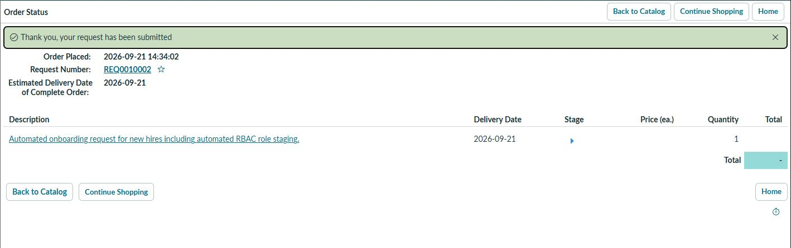
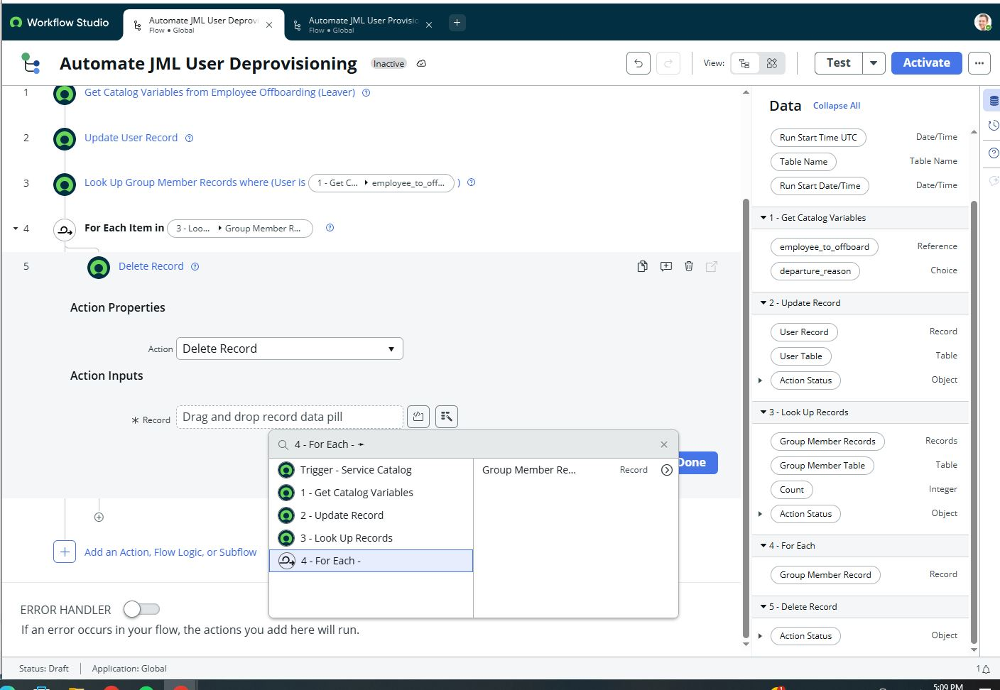

# Enterprise IAM & Identity Governance Lab

An end-to-end Identity & Access Management (IAM) and Identity Governance & Administration (IGA) architecture demonstrating the full Zero Trust identity lifecycle: federated single sign-on with multi-factor authentication, automated cloud posture auditing, and IT Service Management (ITSM) lifecycle governance.

---

## Architecture Overview

```text
+------------------------+    +-----------------------+    +------------------------+
|  Cloud Security Audit  |    |  Relying Application  |    |   ServiceNow ITSM/IGA  |
|      (AWS / Boto3)     |    |        (Flask)        |    |     (Flow Designer)    |
| - IAM Wildcard Audits  |    | - Session Encryption  |    | - Service Catalog Form |
| - Public S3 ACL Scans  |    | - User Profile Claims |    | - JML Automated Engine |
+------------------------+    +-----------------------+    +------------------------+

---

## Core Pillars

### 1. Federated Authentication & MFA (Auth0 & Flask)
* **Protocol Implementation:** Configured OAuth 2.0 and OpenID Connect (OIDC) authentication with secure session cookie persistence (`CookieStore` encrypted with AES).
* **Multi-Factor Authentication:** Enforced one-time password (OTP) verification policies at the IdP layer prior to granting token access to relying applications.
* **Claims Handling:** Decoded and rendered ID token claims (`sub`, `email`, profile metadata) securely in the application runtime.

### 2. Cloud Security Auditing & Least Privilege (AWS & Python/Boto3)
* **IAM Policy Analysis:** Programmatically inspected IAM roles for over-privileged access, specifically scanning for direct attachments of `AdministratorAccess` and wildcard (`*`) policy actions.
* **Storage ACL Inspection:** Scanned S3 buckets to identify unauthorized public read/write grants (`http://acs.amazonaws.com/groups/global/AllUsers`) violating CIS AWS Foundations Benchmarks.

### 3. Identity Governance & Automated JML Lifecycle (ServiceNow)
* **Intake Standardization:** Created self-service catalog intake forms (`Maintain Items`) with strict reference fields to prevent provisioning errors and deflect routine helpdesk tickets.
* **Joiner Phase:** Automated employee onboarding via Flow Designer, extracting catalog variables to create user records in `sys_user` and provision role-based access control (RBAC) groups in `sys_user_grmember`.
* **Leaver Phase:** Orchestrated zero-touch offboarding workflows that dynamically query existing user entitlements, delete group records to eliminate access creep, toggle `Active` to `false`, and enforce immediate account lockout (`Locked out = true`).

---

## Verification & Execution Artifacts

### Cloud Security Audit
Automated policy and bucket scanner identifying overly permissive cloud roles and public storage:


### ServiceNow Catalog Intake & Flow Designer Automation
Self-service catalog intake request submitted for new employee onboarding:


Automated deprovisioning workflow executing in ServiceNow Flow Designer:


---

## Setup & Local Run

### Prerequisites
* Python 3.10+
* AWS CLI configured (`aws configure`)
* Auth0 Developer Account
* ServiceNow Personal Developer Instance (PDI)

### 1. Repository Setup & Dependencies
```powershell
# Clone the repository
git clone [https://github.com/Tej314/Identity-Governance-JML-Lab.git](https://github.com/Tej314/Identity-Governance-JML-Lab.git)
cd Identity-Governance-JML-Lab

# Create and activate virtual environment
python -m venv venv
.\venv\Scripts\Activate.ps1

# Install requirements
pip install flask auth0-server-python python-dotenv boto3

### 2. Run the SSO Authentication Server
```powershell
python server.py

### 3. Run the Cloud Security Scanner
```powershell
python iam_acl_audit.py

Security Framework Alignment
NIST SP 800-63B: Digital Identity Guidelines (MFA, token-based authentication).

CIS AWS Foundations Benchmark: Enforcing least privilege and eliminating public S3 ACLs.

ISO/IEC 27001 (A.9.2): User access provisioning and deprovisioning lifecycle controls.